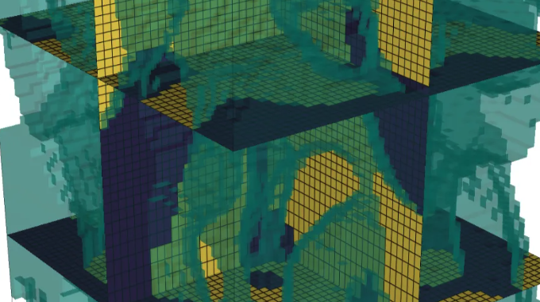

## Efficient 3D inversions using the Richards equation 

_Rowan Cockett, Lindsey J. Heagy and Eldad Haber_

https://doi.org/10.1016/j.cageo.2018.04.006



## Summary

Fluid flow in the vadose zone is governed by the Richards equation; it is parameterized by hydraulic conductivity, which is a nonlinear function of pressure head. Investigations in the vadose zone typically require characterizing distributed hydraulic properties. Water content or pressure head data may include direct measurements made from boreholes. Increasingly, proxy measurements from hydrogeophysics are being used to supply more spatially and temporally dense data sets. Inferring hydraulic parameters from such datasets requires the ability to efficiently solve and optimize the nonlinear time domain Richards equation. This is particularly important as the number of parameters to be estimated in a vadose zone inversion continues to grow. In this paper, we describe an efficient technique to invert for distributed hydraulic properties in 1D, 2D, and 3D. Our technique does not store the Jacobian matrix, but rather computes its product with a vector. Existing literature for the Richards equation inversion explicitly calculates the sensitivity matrix using finite difference or automatic differentiation, however, for large scale problems these methods are constrained by computation and/or memory. Using an implicit sensitivity algorithm enables large scale inversion problems for any distributed hydraulic parameters in the Richards equation to become tractable on modest computational resources. We provide an open source implementation of our technique based on the SimPEG framework, and show it in practice for a 3D inversion of saturated hydraulic conductivity using water content data through time. 

## Citation

Cockett, R., Heagy, L. J., & Haber, E. (2018). Efficient 3D inversions using the Richards equation. Computers & Geosciences, 116, 91–102. https://doi.org/10.1016/j.cageo.2018.04.006

```
@article{cockett_computers_2018,
title = {Efficient 3D inversions using the Richards equation},
journal = {Computers & Geosciences},
volume = {116},
pages = {91-102},
year = {2018},
issn = {0098-3004},
doi = {https://doi.org/10.1016/j.cageo.2018.04.006},
url = {https://www.sciencedirect.com/science/article/pii/S0098300417311494}
}
```
